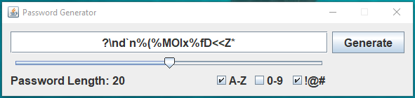

# Java Password Generator

## Description

The "Java Password Generator" project is a basic application developed to apply fundamental programming
concepts in Java, focusing on creating a graphical interface using the `Swing` library. 
The primary objective of this project is to design a password generator that empowers users to
customize the structure of the generated passwords according to their preferences.

## Features

- Graphical Interface: The project harnesses the `Swing` library to craft an intuitive graphical 
interface, enabling users to seamlessly interact with the password generator.

- Customization Options: Users are empowered to select the desired password length and specify 
character types to include (uppercase, lowercase, numbers, special characters).

- Random Password Generation: he program utilizes the Java `Random` library to generate random numbers,
ensuring the creation of highly secure passwords.

- Efficient Layout: The interface is meticulously organized using GroupLayout, guaranteeing a well-structured
arrangement of UI components.

## Applied Concepts

Throughout the development of the project, various programming concepts in Java were put
into practice, encompassing:

- Utilization of the Swing Library: Creation of windows, buttons, text fields, and other graphical components
to establish an interactive GUI.

- Layout Management: Implementation of GroupLayout to precisely define and manage the layout of UI components within
the interface.

- Event Handling: Skillful implementation of event handling mechanisms to capture and respond to user interactions 
effectively.

## How to Run

1. Ensure you have the Java JDK installed on your machine.
2. Clone this repository: `git clone https://github.com/renatolec/pwgen.git`
3. Navigate to the project directory: `cd pwgen/src`
4. Compile the source code: `javac Pwgen.java`
5. Run the program: `java Pwgen`

## Conclusion

The "Java Password Generator" project with a Swing interface showcases the practical application of 
core Java programming concepts, combined with graphical user interface design. 
By creating a user-friendly interface for password generation, the project exemplifies how Java can be utilized 
to develop interactive and visually appealing solutions.